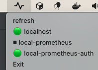
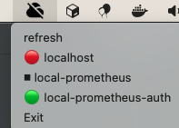

# mcalert

This application gives you a nifty icon in the Mac Taskbar 
"" which indicates
the status of your Kubernetes cluster by examining the Prometheus status.

When clicking on the icon, you get a dropdown list which allows you to identify the cluster
which reports a problem:




If you click on one of the configurations in the dropdown, you toggle 
whether it gets checked or not. In the example images "local-prometheus" is
deactivated. You decide your own names in the configuration.

You need jdk-21 with jpackage. The rest of the dependencies should get pulled in.

If running on Gnome, you need the
[Tray Icons: Reloaded](https://extensions.gnome.org/extension/2890/tray-icons-reloaded/)
extension.

# Create a Mac DMG image

```shell
./mvnw -B clean package
cd target
jpackage --verbose --name mcalert --input quarkus-app \
    --description "Read Prometheus endpoint and show status as toolbar icon" \
    --icon ../mcalert.icns \
    --main-jar quarkus-run.jar 
```

## Configure

Create a file in your home directory named `$HOME/.mcalert.properties` and
configure endpoints. You can have as many endpoints as you like:
```
mcalert.prometheus.endpoints.<NAME>.uri=http://prometheus.somewhere.local.gd:9090/api/v1/alerts
mcalert.prometheus.endpoints.<NAME>.ignore-alerts=CPUThrottlingHigh,KubeControllerManagerDown
mcalert.prometheus.endpoints.<NAME>.watchdog-alerts=disabled
```
You can have different endpoints with different `NAME`. Fill in the relevant alerts for each environment.

You can supply headers. The example illustrates what to do when you want an `Authorization` header.
By increasing the index, you can add more headers.

```
mcalert.prometheus.endpoints<NAME>.header[0].name=Authorization
mcalert.prometheus.endpoints<NAME>.header[0].content=Basic dXNlcm5hbWU6cGFzc3dvcmQ=
```

### Use grafana as Prometheus proxy

Give mcalert the following configuration to dynamically find and use the
datasource proxy for Prometheus:
```
mcalert.prometheus.endpoints.prometheus.uri=http://grafana.local.gd:31090/api/datasources
mcalert.prometheus.endpoints.prometheus.datasource=DATASOURCE_NAME
```
The URI will, of course, be different for you. Notice `DATASOURCE_NAME` part of the configuration.
That **must match the name of the datasource** in grafana, as datasource configuration is a list
in grafana. By setting the datasource name, you have also flagged that this is a grafana datasource
endpoint.

The other mcalert configuration properties are the same.

**Notice**: Currently the datasource is read upon start of mcalert. If the datasource
changes, you need to restart the application. 

### Finding and using Prometheus directly if datasource ID does not change

If you know that the datasource are not going to change, you can configure grafana as 
and endpoint directly, by creating a `mcalert.prometheus.endpoints` like this:

```
mcalert.prometheus.endpoints.grafana.uri=http://grafana.somewhere.local.gd:3000/api/datasources/uid/P1809F7CD0C75ACF3/resources/api/v1/alerts?state=firing
```

You can glean the ID by calling "/api/datasource" on
grafana, similar to: `http://grafana.somewhere.local.gd:3000/api/datasources`

### Dev mode configuration:

Dev mode configuration in [application.properties](src%2Fmain%2Fresources%2Fapplication.properties),
expects a port-forward proxy to Prometheus similar to:
```
kubectl port-forward -n monitoring svc/prometheus-k8s 9090
 ```


## Details

This is a Quarkus based application created with:

```shell
quarkus create app io.github.nostra:mcalert --java=21 --no-code
```
```shell
quarkus extension add picocli
quarkus extension add resteasy-reactive-jackson
quarkus extension add rest-client-reactive-jackson
quarkus extension add quarkus-scheduler
```

## Build with

```shell
./mvnw -B package
```

## Run with

```shell
java -jar target/quarkus-app/quarkus-run.jar 
```

## Test static file

In order to test an endpoint the most easily, use jwebserver:

```shell
$$JAVA_HOME/bin/jwebserver -b localhost -p 9090 -d $PWD/src/test/resources 
```

Open http://localhost:9090/

## Icons

Icons downloaded from
- https://remixicon.com/icon/cloud-off-fill
- https://remixicon.com/icon/bug-line
- https://remixicon.com/icon/circle-line
- https://remixicon.com/icon/pulse-line
- https://remixicon.com/icon/shut-down-line
- https://remixicon.com/icon/information-off-line
- TODO Use this for 404 https://remixicon.com/icon/star-off-line